## **Ceyhun Onur**

## _18/10/2019_

# Task 1
Needed packages:

```r
installed.packages("data.table")
```

```
##      Package LibPath Version Priority Depends Imports LinkingTo Suggests
##      Enhances License License_is_FOSS License_restricts_use OS_type Archs
##      MD5sum NeedsCompilation Built
```

```r
library(data.table)
```
## Subtask 1

```r
# Read frome the snapshot, select only columns we're interested in.
matches <- fread("/home/ceyonur/git/CMPE/fall19-ceyonur/data/homework1/matches.csv", select=c("match_id", "league_id","match_status","match_hometeam_score", "match_awayteam_score"))
# get only finished english premier league matches
epl_matches <- matches[league_id == 148 & match_status == "Finished"]
# Construct histogram with home team scores.
h1 <- hist(epl_matches$match_hometeam_score, breaks = seq(-1, max(epl_matches$match_hometeam_score),1), xlab="Home Score(goals)", ylab="Number of Games", col = "red", main = "Home Score Histogram")
# x points for hometeam scores
xfit<-seq(min(epl_matches$match_hometeam_score)-1,max(epl_matches$match_hometeam_score),length=40)
# normalized values for y points
yfit<-dnorm(xfit,mean=mean(epl_matches$match_hometeam_score),sd=sd(epl_matches$match_hometeam_score))
yfit <- yfit*diff(h1$mids[1:2])*length(epl_matches$match_hometeam_score)
# draw normalized line
lines(xfit, yfit, col="blue", lwd=2)
```

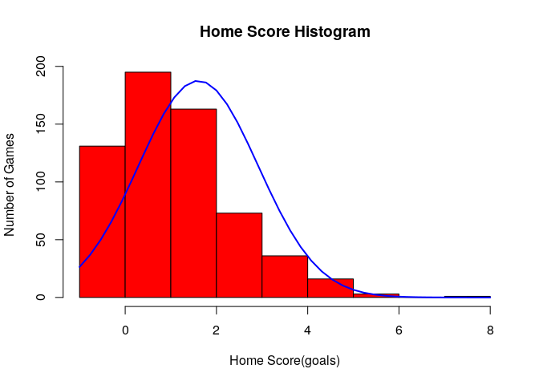<!-- -->


```r
h2 <- hist(epl_matches$match_awayteam_score, breaks = seq(-1, max(epl_matches$match_awayteam_score),1), xlab="Away Score(goals)", ylab="Number of Games", col = "red", main = "Away Score Histogram")
xfit<-seq(min(epl_matches$match_awayteam_score)-1,max(epl_matches$match_awayteam_score),length=40)
yfit<-dnorm(xfit,mean=mean(epl_matches$match_awayteam_score),sd=sd(epl_matches$match_awayteam_score))
yfit <- yfit*diff(h2$mids[1:2])*length(epl_matches$match_awayteam_score)
lines(xfit, yfit, col="blue", lwd=2)
```

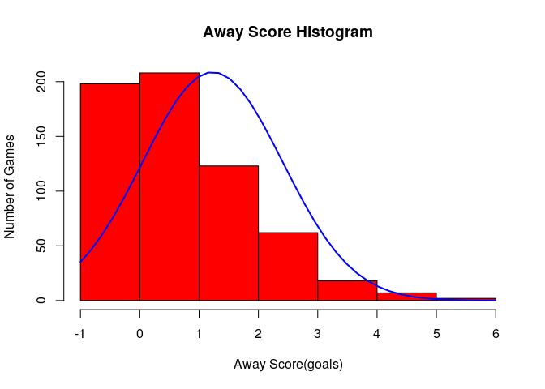<!-- -->


```r
epl_diff <- epl_matches$match_hometeam_score - epl_matches$match_awayteam_score
h3 <- hist(epl_diff, breaks = seq(min(epl_diff)-1, max(epl_diff),1), xlab="Home Goals - Away Goals", ylab="Number of Games", col = "red", main = "Home - Away Score Histogram")
xfit<-seq(min(epl_diff),max(epl_diff),length=40)
yfit<-dnorm(xfit,mean=mean(epl_diff),sd=sd(epl_diff))
yfit <- yfit*diff(h3$mids[1:2])*length(epl_diff)
lines(xfit, yfit, col="blue", lwd=2)
```

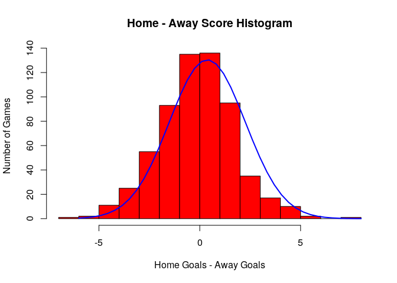<!-- -->

## Subtask 2
### Home team score (poisson)

```r
# show densities for each number of goals
h1_table = data.table(number_of_goals = h1$breaks[-1], probability = h1$density)
h1_table
```

```
##    number_of_goals probability
## 1:               0 0.211974110
## 2:               1 0.315533981
## 3:               2 0.263754045
## 4:               3 0.118122977
## 5:               4 0.058252427
## 6:               5 0.025889968
## 7:               6 0.004854369
## 8:               7 0.000000000
## 9:               8 0.001618123
```

```r
mean_home_scores = mean(epl_matches$match_hometeam_score)
poisson_home = dpois(min(epl_matches$match_hometeam_score):max(epl_matches$match_hometeam_score), mean_home_scores)
poisson_home = round(poisson_home * nrow(epl_matches))
barplot(poisson_home, names.arg = h1$breaks[-1], xlab="Home Score(goals)", ylab="Number of Games", col = "red", main = "Home Score Poisson Histogram")
```

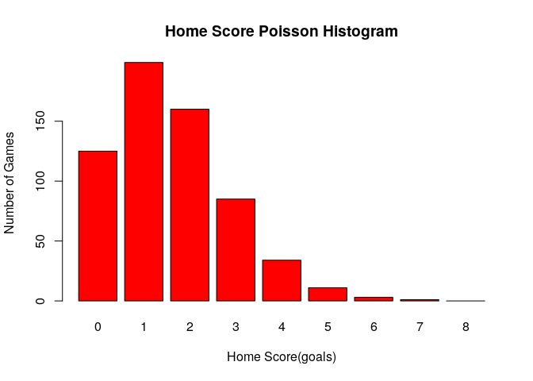<!-- -->
### Away team score (poisson)

```r
# show densities for each number of goals
h2_table = data.table(number_of_goals = h2$breaks[-1], probability = h2$density)
h2_table
```

```
##    number_of_goals probability
## 1:               0 0.320388350
## 2:               1 0.336569579
## 3:               2 0.199029126
## 4:               3 0.100323625
## 5:               4 0.029126214
## 6:               5 0.011326861
## 7:               6 0.003236246
```

```r
mean_away_scores = mean(epl_matches$match_awayteam_score)
poisson_away = dpois(min(epl_matches$match_awayteam_score):max(epl_matches$match_awayteam_score), mean_away_scores)
poisson_away = round(poisson_away * nrow(epl_matches))
barplot(poisson_away, names.arg = h2$breaks[-1], xlab="Away Score(goals)", ylab="Number of Games", col = "red", main = "Away Score Poisson Histogram")
```

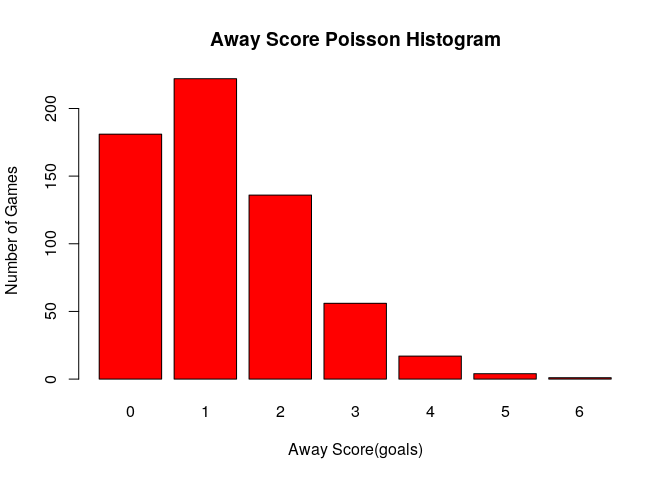<!-- -->
### Home - Away team score (poisson)

```r
# show densities for each number of goals
h3_table = data.table(number_of_goals = h3$breaks[-1], probability = h3$density)
h3_table
```

```
##     number_of_goals probability
##  1:              -6 0.001618123
##  2:              -5 0.003236246
##  3:              -4 0.017799353
##  4:              -3 0.040453074
##  5:              -2 0.088996764
##  6:              -1 0.150485437
##  7:               0 0.218446602
##  8:               1 0.220064725
##  9:               2 0.153721683
## 10:               3 0.056634304
## 11:               4 0.027508091
## 12:               5 0.016181230
## 13:               6 0.003236246
## 14:               7 0.000000000
## 15:               8 0.001618123
```

```r
mean_ha_scores = mean(epl_diff)
poisson_ha = dnorm(min(epl_diff):max(epl_diff), mean=mean_ha_scores, sd = sd(epl_diff))
poisson_ha = round(poisson_ha * nrow(epl_matches))
barplot(poisson_ha, names.arg = h3$breaks[-1], xlab="Home - Away Score(goals)", ylab="Number of Games", col = "red", main = "Home - Away Score Poisson Histogram")
```

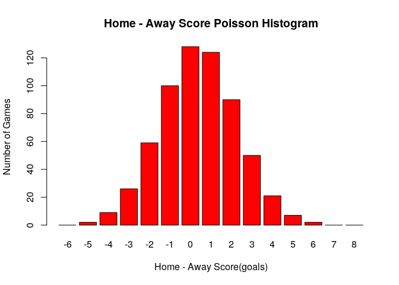<!-- -->
# Task 2

```r
# read bets csv
bets <- fread("/home/ceyonur/git/CMPE/fall19-ceyonur/data/homework1/bets.csv")
# add column to indicate if match ended as draw
epl_matches <- epl_matches[, is_draw := as.numeric(match_awayteam_score == match_hometeam_score)]
# get only bets data with win, draw or lose.
bets <- bets[variable %in% c("odd_1", "odd_x", "odd_2" )]
# join bets and match data by match_id
merged_data <- merge(epl_matches, bets, by='match_id')
# find the most active bookmaker
bookmaker_data_count <- bets[, .N, by = c("odd_bookmakers")]
bookmaker_data_count <- bookmaker_data_count[order(-N)]
# select the first 4 bookmaker name that has most bets
bookmaker_names <- bookmaker_data_count[1:4]$odd_bookmakers
bookmaker_data_count
```

```
##      odd_bookmakers    N
##   1:          1xBet 9228
##   2:           bwin 8760
##   3:         Unibet 8697
##   4:          18bet 8676
##   5:       888sport 8625
##  ---                    
##  99:      Planetwin   81
## 100:         Bovada   69
## 101:        Kto.com   42
## 102:        betcart   12
## 103:           Guts   12
```

```r
bookmaker_names
```

```
## [1] "1xBet"  "bwin"   "Unibet" "18bet"
```
### Custom functions:

```r
# Use this function to analyze for different bookmakers.
bookmaker_draw_analysis <- function(bookmaker_name, data) {
  # get the data with selected bookmaker
  bookmaker_bets <- data[odd_bookmakers == bookmaker_name]
  # find probabilities from given odds
  bookmaker_bets <- bookmaker_bets[, c("p_win", "p_draw", "p_lose") := list(1/value[variable == 'odd_1'], 1/value[variable == 'odd_x'], 1/value[variable == 'odd_2']), by = list(match_id, odd_bookmakers, variable)]
  # group data by match_id and odd_bookmakers, so that we can have only one row for each match and bookmaker
  bookmaker_bets <- aggregate(bookmaker_bets[,c("is_draw", "p_win","p_draw","p_lose")], by=list(bookmaker_bets$match_id, bookmaker_bets$odd_bookmakers), FUN = function (x) first(na.omit(x)))
  # convert it back to data table
  bookmaker_bets <- data.table(bookmaker_bets)
  # rename grouped columns
  names(bookmaker_bets)[1] <- "match_id"
  names(bookmaker_bets)[2] <- "odd_bookmakers"
  # TASK 2.2
  # convert probabilities by implied probability function for each probability type
  bookmaker_bets[, p_win_imp:=p_win / (p_win + p_draw + p_lose)]
  bookmaker_bets[, p_draw_imp:=p_draw / (p_win + p_draw + p_lose)]
  bookmaker_bets[, p_lose_imp:=p_lose / (p_win + p_draw + p_lose)]
  # add column for P(WIN - LOSE)
  bookmaker_bets[, p_win_lose_imp := p_win_imp - p_lose_imp]
}
```


```r
# Use this function to split data to bins
bookmaker_bin_table <- function(bookmaker_bets){
  # TASK 2.3
  # bookmaker odds may not be larger than certain values, so use the data to determine bins.
  cutpoints <- seq(min(bookmaker_bets$p_win_lose_imp) - 0.06, max(bookmaker_bets$p_win_lose_imp) + 0.06, 0.05)
  # split impled P(WIN-LOSE) to bins accordingly.
  bookmaker_bets[,w_l_cut:=cut(p_win_lose_imp, cutpoints)]
  # find mean for impled P(DRAW) in each bin and also find matches resulted with draw in each bin. Also take mean for drawe matches.
  bookmaker_bin_table <- bookmaker_bets[,list(emprical_over=mean(is_draw), probabilistic_over=mean(p_draw_imp),draw_count=sum(is_draw), total_count=.N),by=list(w_l_cut)]
  # Order by bins
  bookmaker_bin_table <- bookmaker_bin_table[order(w_l_cut)]
}
```
### First book maker

```r
# 1st
first_bookmaker_name <- bookmaker_names[1]
# Task 2.1-2
first_bets <- bookmaker_draw_analysis(first_bookmaker_name, merged_data)
first_bin_table <- bookmaker_bin_table(first_bets)
first_bets
```

```
##      match_id odd_bookmakers is_draw     p_win    p_draw    p_lose
##   1:   150842          1xBet       1 0.1960784 0.2702703 0.5649718
##   2:   150844          1xBet       0 0.3236246 0.3030303 0.4065041
##   3:   156845          1xBet       0 0.4166667 0.3225806 0.2824859
##   4:   156847          1xBet       0 0.5494505 0.2673797 0.2074689
##   5:   156850          1xBet       1 0.5555556 0.2793296 0.1923077
##  ---                                                              
## 271:   237422          1xBet       0 0.4504505 0.2941176 0.2777778
## 272:   237423          1xBet       0 0.5586592 0.2793296 0.2450980
## 273:   237437          1xBet       0 0.3623188 0.2808989 0.3816794
## 274:   267786          1xBet       0 0.2631579 0.2604167 0.5376344
## 275:   307209          1xBet       0 0.3105590 0.2994012 0.4184100
##      p_win_imp p_draw_imp p_lose_imp p_win_lose_imp           w_l_cut
##   1: 0.1901237  0.2620624  0.5478140    -0.35769030   (-0.389,-0.339]
##   2: 0.3132379  0.2933046  0.3934574    -0.08021947 (-0.0888,-0.0388]
##   3: 0.4078038  0.3157191  0.2764771     0.13132664     (0.111,0.161]
##   4: 0.5364161  0.2610367  0.2025472     0.33386895     (0.311,0.361]
##   5: 0.5408483  0.2719349  0.1872167     0.35363161     (0.311,0.361]
##  ---                                                                 
## 271: 0.4406048  0.2876890  0.2717063     0.16889849     (0.161,0.211]
## 272: 0.5158028  0.2579014  0.2262958     0.28950695     (0.261,0.311]
## 273: 0.3535173  0.2740752  0.3724075    -0.01889024  (-0.0388,0.0112]
## 274: 0.2479793  0.2453962  0.5066244    -0.25864511   (-0.289,-0.239]
## 275: 0.3019914  0.2911414  0.4068671    -0.10487569  (-0.139,-0.0888]
```

```r
first_bin_table
```

```
##               w_l_cut emprical_over probabilistic_over draw_count
##  1:   (-0.789,-0.739]     0.0000000         0.11556573          0
##  2:   (-0.739,-0.689]     0.0000000         0.13637569          0
##  3:   (-0.689,-0.639]     0.5000000         0.15822887          1
##  4:   (-0.639,-0.589]     0.0000000         0.18225718          0
##  5:   (-0.589,-0.539]     0.2500000         0.19203707          1
##  6:   (-0.539,-0.489]     0.0000000         0.19321738          0
##  7:   (-0.489,-0.439]     0.5000000         0.21542182          1
##  8:   (-0.439,-0.389]     0.4000000         0.24241667          2
##  9:   (-0.389,-0.339]     0.2857143         0.24390615          2
## 10:   (-0.339,-0.289]     0.3333333         0.25112209          1
## 11:   (-0.289,-0.239]     0.1428571         0.25621042          1
## 12:   (-0.239,-0.189]     0.1666667         0.26435757          1
## 13:   (-0.189,-0.139]     0.0000000         0.27395028          0
## 14:  (-0.139,-0.0888]     0.3333333         0.28224365          3
## 15: (-0.0888,-0.0388]     0.2222222         0.28562775          2
## 16:  (-0.0388,0.0112]     0.1538462         0.28842607          2
## 17:   (0.0112,0.0612]     0.3750000         0.29182883          6
## 18:    (0.0612,0.111]     0.2380952         0.28082271          5
## 19:     (0.111,0.161]     0.2142857         0.28889691          3
## 20:     (0.161,0.211]     0.5000000         0.28158723          7
## 21:     (0.211,0.261]     0.1818182         0.26569345          4
## 22:     (0.261,0.311]     0.0000000         0.26673031          0
## 23:     (0.311,0.361]     0.2142857         0.25654345          3
## 24:     (0.361,0.411]     0.2500000         0.24833678          2
## 25:     (0.411,0.461]     0.2857143         0.23006812          2
## 26:     (0.461,0.511]     0.2500000         0.21372948          2
## 27:     (0.511,0.561]     0.2000000         0.19949203          2
## 28:     (0.561,0.611]     0.1111111         0.19821467          1
## 29:     (0.611,0.661]     0.0000000         0.17103990          0
## 30:     (0.661,0.711]     0.2857143         0.15328946          2
## 31:     (0.711,0.761]     0.0000000         0.13140749          0
## 32:     (0.761,0.811]     0.0000000         0.11101912          0
## 33:     (0.811,0.861]     0.0000000         0.09937591          0
## 34:     (0.861,0.911]     0.0000000         0.07847800          0
##               w_l_cut emprical_over probabilistic_over draw_count
##     total_count
##  1:           3
##  2:           2
##  3:           2
##  4:           4
##  5:           4
##  6:           3
##  7:           2
##  8:           5
##  9:           7
## 10:           3
## 11:           7
## 12:           6
## 13:           7
## 14:           9
## 15:           9
## 16:          13
## 17:          16
## 18:          21
## 19:          14
## 20:          14
## 21:          22
## 22:          11
## 23:          14
## 24:           8
## 25:           7
## 26:           8
## 27:          10
## 28:           9
## 29:          13
## 30:           7
## 31:           5
## 32:           6
## 33:           3
## 34:           1
##     total_count
```

```r
# Task 2.3
# Plot the implied data
plot(first_bets$p_win_imp - first_bets$p_lose_imp, first_bets$p_draw_imp,cex=0.5,col='red',xlab="P(WIN_IMP) - P(LOSE_IMP)", ylab="P(DRAW_IMP)", main = first_bookmaker_name)
```

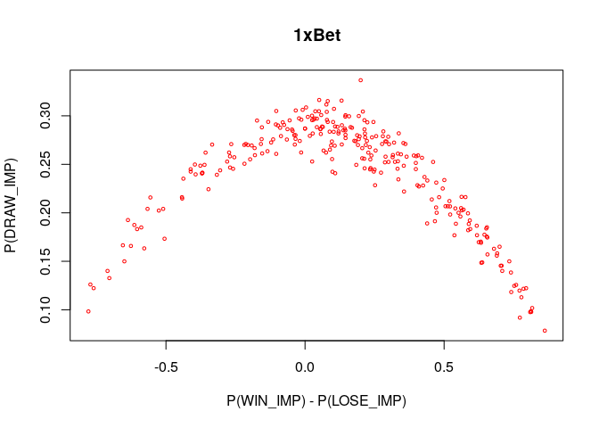<!-- -->

```r
# Task 2.4
# Draw points for bins
plot(first_bin_table$w_l_cut, first_bin_table$emprical_over,ylab="P(DRAW)",xlab="bin", main = first_bookmaker_name)
# Draw both calculated emprical data(calculated result) and probabilistic(real draw) lines to compare. 
lines(lowess(first_bin_table$w_l_cut, first_bin_table$emprical_over), col="black", lwd=1)
lines(lowess(first_bin_table$w_l_cut, first_bin_table$probabilistic_over), col="red", lwd=1)
legend("topright", legend=c("Calculated Probability", "Real Probability"), col=c("black","red"), lty=1:1, cex=0.8)
```

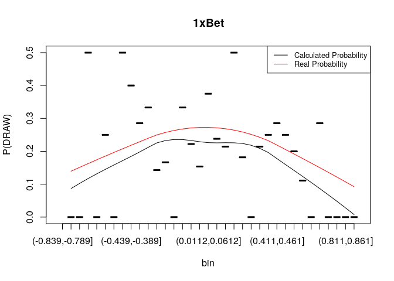<!-- -->

```r
# 1xBet seems a good bookmaker since the real probability (given by bookmaker) is higher than the calculated one.
```
### Second Bookmaker

```r
# 2nd
second_bookmaker_name <- bookmaker_names[2]
# Task 2.1-2
second_bets <- bookmaker_draw_analysis(second_bookmaker_name, merged_data)
second_bin_table <- bookmaker_bin_table(second_bets)
second_bets
```

```
##      match_id odd_bookmakers is_draw     p_win    p_draw    p_lose
##   1:   150844           bwin       0 0.3921569 0.3030303 0.4166667
##   2:   156845           bwin       0 0.4761905 0.3333333 0.2857143
##   3:   156847           bwin       0 0.5882353 0.3125000 0.2000000
##   4:   156850           bwin       1 0.5555556 0.3125000 0.2309469
##   5:   157536           bwin       0 0.2941176 0.3030303 0.4761905
##  ---                                                              
## 269:   237422           bwin       0 0.4761905 0.3030303 0.2941176
## 270:   237423           bwin       0 0.3225806 0.3448276 0.4347826
## 271:   237437           bwin       0 0.6250000 0.2777778 0.1818182
## 272:   267786           bwin       0 0.2777778 0.2777778 0.5555556
## 273:   307209           bwin       0 0.5000000 0.2857143 0.2857143
##      p_win_imp p_draw_imp p_lose_imp p_win_lose_imp           w_l_cut
##   1: 0.3527054  0.2725451  0.3747495    -0.02204409 (-0.0412,0.00876]
##   2: 0.4347826  0.3043478  0.2608696     0.17391304     (0.159,0.209]
##   3: 0.5344021  0.2839011  0.1816967     0.35270541     (0.309,0.359]
##   4: 0.5055089  0.2843488  0.2101423     0.29536665     (0.259,0.309]
##   5: 0.2740214  0.2823250  0.4436536    -0.16963227   (-0.191,-0.141]
##  ---                                                                 
## 269: 0.4436536  0.2823250  0.2740214     0.16963227     (0.159,0.209]
## 270: 0.2926722  0.3128565  0.3944713    -0.10179903  (-0.141,-0.0912]
## 271: 0.5762515  0.2561118  0.1676368     0.40861467     (0.359,0.409]
## 272: 0.2500000  0.2500000  0.5000000    -0.25000000   (-0.291,-0.241]
## 273: 0.4666667  0.2666667  0.2666667     0.20000000     (0.159,0.209]
```

```r
second_bin_table
```

```
##               w_l_cut emprical_over probabilistic_over draw_count
##  1:   (-0.841,-0.791]     0.0000000         0.09079587          0
##  2:   (-0.791,-0.741]     0.5000000         0.12297070          1
##  3:   (-0.741,-0.691]     0.0000000         0.13967447          0
##  4:   (-0.691,-0.641]     0.3333333         0.16174292          1
##  5:   (-0.641,-0.591]     0.0000000         0.17296681          0
##  6:   (-0.591,-0.541]     0.5000000         0.20792378          2
##  7:   (-0.541,-0.491]     0.0000000         0.18997496          0
##  8:   (-0.491,-0.441]     0.3333333         0.22494700          1
##  9:   (-0.441,-0.391]     0.5000000         0.23459430          3
## 10:   (-0.391,-0.341]     0.3333333         0.24863041          1
## 11:   (-0.341,-0.291]     0.2000000         0.25208666          1
## 12:   (-0.291,-0.241]     0.2500000         0.25256626          1
## 13:   (-0.241,-0.191]     0.5000000         0.26452845          2
## 14:   (-0.191,-0.141]     0.2000000         0.26998327          2
## 15:  (-0.141,-0.0912]     0.1000000         0.28428844          1
## 16: (-0.0912,-0.0412]     0.1428571         0.28337984          1
## 17: (-0.0412,0.00876]     0.1538462         0.28274062          2
## 18:  (0.00876,0.0588]     0.3333333         0.28615403          7
## 19:    (0.0588,0.109]     0.2500000         0.28079381          3
## 20:     (0.109,0.159]     0.1875000         0.28275086          3
## 21:     (0.159,0.209]     0.1818182         0.28091703          4
## 22:     (0.209,0.259]     0.1875000         0.26847510          3
## 23:     (0.259,0.309]     0.1538462         0.27064024          2
## 24:     (0.309,0.359]     0.1250000         0.26752679          1
## 25:     (0.359,0.409]     0.5714286         0.24440179          4
## 26:     (0.409,0.459]     0.1818182         0.23207344          2
## 27:     (0.459,0.509]     0.2857143         0.22185319          2
## 28:     (0.509,0.559]     0.1428571         0.21157810          1
## 29:     (0.559,0.609]     0.0000000         0.18975600          0
## 30:     (0.609,0.659]     0.0000000         0.17273170          0
## 31:     (0.659,0.709]     0.3333333         0.15886928          3
## 32:     (0.709,0.759]     0.0000000         0.13338413          0
## 33:     (0.759,0.809]     0.0000000         0.10973906          0
## 34:     (0.809,0.859]     0.2500000         0.08191579          1
##               w_l_cut emprical_over probabilistic_over draw_count
##     total_count
##  1:           2
##  2:           2
##  3:           2
##  4:           3
##  5:           5
##  6:           4
##  7:           2
##  8:           3
##  9:           6
## 10:           3
## 11:           5
## 12:           4
## 13:           4
## 14:          10
## 15:          10
## 16:           7
## 17:          13
## 18:          21
## 19:          12
## 20:          16
## 21:          22
## 22:          16
## 23:          13
## 24:           8
## 25:           7
## 26:          11
## 27:           7
## 28:           7
## 29:          11
## 30:          10
## 31:           9
## 32:           7
## 33:           7
## 34:           4
##     total_count
```


```r
# Task 2.3
plot(second_bets$p_win_imp - second_bets$p_lose_imp, second_bets$p_draw_imp,cex=0.5,col='red',xlab="P(WIN_IMP) - P(LOSE_IMP)", ylab="P(DRAW_IMP)", main = second_bookmaker_name)
```

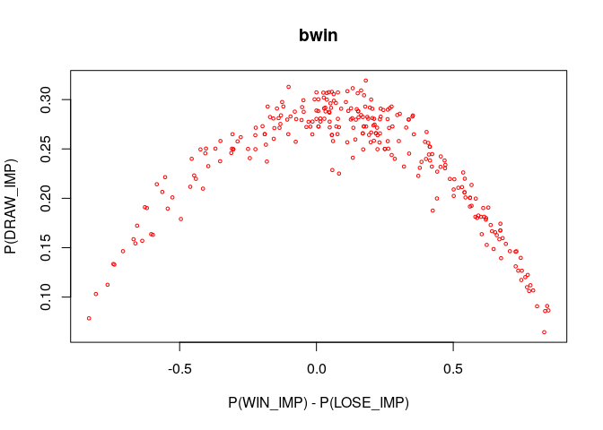<!-- -->


```r
# Task 2.4
plot(second_bin_table$w_l_cut, second_bin_table$emprical_over,ylab="P(DRAW)",xlab="bin", main = second_bookmaker_name)
lines(lowess(second_bin_table$w_l_cut, second_bin_table$emprical_over), col="black", lwd=1)
lines(lowess(second_bin_table$w_l_cut, second_bin_table$probabilistic_over), col="red", lwd=1)
legend("topright", legend=c("Calculated Probability", "Real Probability"), col=c("black","red"), lty=1:1, cex=0.8)
```

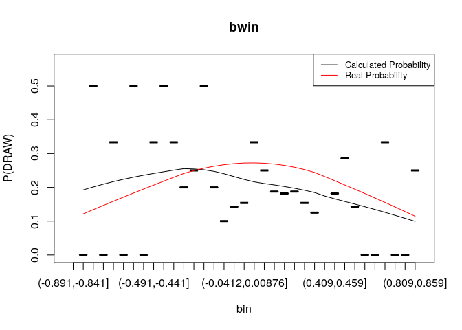<!-- -->

```r
# bwin is arguably not a good bookmaker at the point(-0.491, -0.441) where probability lines crosses and calculated probability is higher than real one.
```
### Third bookmaker

```r
# 3rd
third_bookmaker_name <- bookmaker_names[3]
# Task 2.1-2
third_bets <- bookmaker_draw_analysis(third_bookmaker_name, merged_data)
third_bin_table <- bookmaker_bin_table(third_bets)
third_bets
```

```
##      match_id odd_bookmakers is_draw     p_win    p_draw    p_lose
##   1:   156845         Unibet       0 0.4444444 0.3448276 0.2857143
##   2:   156847         Unibet       0 0.5714286 0.2857143 0.2173913
##   3:   156848         Unibet       0 0.3636364 0.3225806 0.3846154
##   4:   156850         Unibet       1 0.5555556 0.3076923 0.2127660
##   5:   157536         Unibet       0 0.3076923 0.2985075 0.4587156
##  ---                                                              
## 268:   237422         Unibet       0 0.2439024 0.2739726 0.5649718
## 269:   237423         Unibet       0 0.5154639 0.2941176 0.2777778
## 270:   237437         Unibet       0 0.6493506 0.2777778 0.1724138
## 271:   267786         Unibet       0 0.2439024 0.2857143 0.5555556
## 272:   307209         Unibet       0 0.4878049 0.2857143 0.2777778
##      p_win_imp p_draw_imp p_lose_imp p_win_lose_imp           w_l_cut
##   1: 0.4134420  0.3207739  0.2657841     0.14765784     (0.135,0.185]
##   2: 0.5317919  0.2658960  0.2023121     0.32947977     (0.285,0.335]
##   3: 0.3395829  0.3012429  0.3591742    -0.01959132 (-0.0654,-0.0154]
##   4: 0.5163089  0.2859557  0.1977353     0.31857360     (0.285,0.335]
##   5: 0.2889359  0.2803110  0.4307531    -0.14181717   (-0.165,-0.115]
##  ---                                                                 
## 268: 0.2252419  0.2530114  0.5217467    -0.29650484   (-0.315,-0.265]
## 269: 0.4740511  0.2704880  0.2554609     0.21859024     (0.185,0.235]
## 270: 0.5905645  0.2526304  0.1568051     0.43375948     (0.385,0.435]
## 271: 0.2247592  0.2632893  0.5119515    -0.28719229   (-0.315,-0.265]
## 272: 0.4640029  0.2717732  0.2642239     0.19977905     (0.185,0.235]
```

```r
third_bin_table
```

```
##               w_l_cut emprical_over probabilistic_over draw_count
##  1:   (-0.815,-0.765]    0.00000000         0.10688520          0
##  2:   (-0.765,-0.715]    0.00000000         0.12830482          0
##  3:   (-0.715,-0.665]    0.00000000         0.14194828          0
##  4:   (-0.665,-0.615]    0.00000000         0.16921483          0
##  5:   (-0.615,-0.565]    0.00000000         0.16674607          0
##  6:   (-0.565,-0.515]    0.25000000         0.20626962          1
##  7:   (-0.515,-0.465]    0.00000000         0.23094425          0
##  8:   (-0.465,-0.415]    0.50000000         0.22329443          2
##  9:   (-0.415,-0.365]    0.25000000         0.24872382          1
## 10:   (-0.365,-0.315]    0.40000000         0.25803273          2
## 11:   (-0.315,-0.265]    0.00000000         0.25871178          0
## 12:   (-0.265,-0.215]    0.33333333         0.25252013          1
## 13:   (-0.215,-0.165]    0.42857143         0.26735849          3
## 14:   (-0.165,-0.115]    0.16666667         0.28113034          2
## 15:  (-0.115,-0.0654]    0.00000000         0.27961528          0
## 16: (-0.0654,-0.0154]    0.21428571         0.28343478          3
## 17:  (-0.0154,0.0346]    0.18181818         0.28902444          2
## 18:   (0.0346,0.0846]    0.34782609         0.28022359          8
## 19:    (0.0846,0.135]    0.15384615         0.28583781          2
## 20:     (0.135,0.185]    0.20000000         0.28400384          4
## 21:     (0.185,0.235]    0.28000000         0.27531494          7
## 22:     (0.235,0.285]    0.07142857         0.26593248          1
## 23:     (0.285,0.335]    0.25000000         0.26501817          2
## 24:     (0.335,0.385]    0.37500000         0.25435455          3
## 25:     (0.385,0.435]    0.23076923         0.24166036          3
## 26:     (0.435,0.485]    0.33333333         0.22776915          1
## 27:     (0.485,0.535]    0.25000000         0.21084797          2
## 28:     (0.535,0.585]    0.07142857         0.20084944          1
## 29:     (0.585,0.635]    0.00000000         0.17341002          0
## 30:     (0.635,0.685]    0.00000000         0.16613522          0
## 31:     (0.685,0.735]    0.50000000         0.14863070          3
## 32:     (0.735,0.785]    0.00000000         0.13196865          0
## 33:     (0.785,0.835]    0.00000000         0.10677696          0
## 34:     (0.835,0.885]    0.00000000         0.08212499          0
##               w_l_cut emprical_over probabilistic_over draw_count
##     total_count
##  1:           2
##  2:           1
##  3:           2
##  4:           4
##  5:           1
##  6:           4
##  7:           1
##  8:           4
##  9:           4
## 10:           5
## 11:           6
## 12:           3
## 13:           7
## 14:          12
## 15:           6
## 16:          14
## 17:          11
## 18:          23
## 19:          13
## 20:          20
## 21:          25
## 22:          14
## 23:           8
## 24:           8
## 25:          13
## 26:           3
## 27:           8
## 28:          14
## 29:           7
## 30:           8
## 31:           6
## 32:           6
## 33:           6
## 34:           3
##     total_count
```

```r
# Task 2.3
plot(third_bets$p_win_imp - third_bets$p_lose_imp, third_bets$p_draw_imp,cex=0.5,col='red',xlab="P(WIN_IMP) - P(LOSE_IMP)", ylab="P(DRAW_IMP)", main = third_bookmaker_name)
```

<!-- -->

```r
# Task 2.4
plot(third_bin_table$w_l_cut, third_bin_table$emprical_over,ylab="P(DRAW)",xlab="bin", main = third_bookmaker_name)
lines(lowess(third_bin_table$w_l_cut, third_bin_table$emprical_over), col="black", lwd=1)
lines(lowess(third_bin_table$w_l_cut, third_bin_table$probabilistic_over), col="red", lwd=1)
legend("topright", legend=c("Calculated Probability", "Real Probability"), col=c("black","red"), lty=1:1, cex=0.8)
```

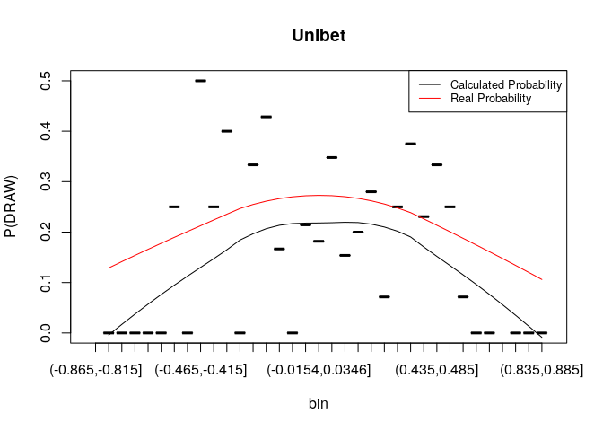<!-- -->

```r
# Unibet is also a good bookmaker.
```

```r
# 4th
fourth_bookmaker_name <- bookmaker_names[4]
# Task 2.1-2
fourth_bets <- bookmaker_draw_analysis(fourth_bookmaker_name, merged_data)
fourth_bin_table <- bookmaker_bin_table(fourth_bets)
fourth_bets
```

```
##      match_id odd_bookmakers is_draw     p_win    p_draw    p_lose
##   1:   156845          18bet       0 0.4255319 0.3460208 0.3105590
##   2:   156847          18bet       0 0.5952381 0.2747253 0.2132196
##   3:   156850          18bet       1 0.5780347 0.2906977 0.2155172
##   4:   157536          18bet       0 0.3105590 0.3105590 0.4608295
##   5:   157537          18bet       0 0.7874016 0.1872659 0.1096491
##  ---                                                              
## 267:   237422          18bet       0 0.4545455 0.3076923 0.3076923
## 268:   237423          18bet       0 0.4761905 0.2985075 0.2857143
## 269:   237437          18bet       0 0.6535948 0.2631579 0.1428571
## 270:   267786          18bet       0 0.2631579 0.2631579 0.5405405
## 271:   307209          18bet       0 0.3333333 0.3076923 0.4255319
##      p_win_imp p_draw_imp p_lose_imp p_win_lose_imp           w_l_cut
##   1: 0.3932421  0.3197644  0.2869935     0.10624865     (0.101,0.151]
##   2: 0.5495268  0.2536278  0.1968454     0.35268139     (0.351,0.401]
##   3: 0.5331196  0.2681096  0.1987709     0.33434870     (0.301,0.351]
##   4: 0.2870370  0.2870370  0.4259259    -0.13888889  (-0.149,-0.0987]
##   5: 0.7261731  0.1727041  0.1011228     0.62505032     (0.601,0.651]
##  ---                                                                 
## 267: 0.4248366  0.2875817  0.2875817     0.13725490     (0.101,0.151]
## 268: 0.4490617  0.2815013  0.2694370     0.17962466     (0.151,0.201]
## 269: 0.6168259  0.2483536  0.1348205     0.48200538     (0.451,0.501]
## 270: 0.2466667  0.2466667  0.5066667    -0.26000000   (-0.299,-0.249]
## 271: 0.3125320  0.2884910  0.3989770    -0.08644501 (-0.0987,-0.0487]
```

```r
fourth_bin_table
```

```
##               w_l_cut emprical_over probabilistic_over draw_count
##  1:   (-0.799,-0.749]    0.00000000         0.11054307          0
##  2:   (-0.749,-0.699]    0.50000000         0.13406549          2
##  3:   (-0.699,-0.649]    0.00000000         0.15668315          0
##  4:   (-0.649,-0.599]    0.00000000         0.17556076          0
##  5:   (-0.599,-0.549]    0.33333333         0.18783053          1
##  6:   (-0.549,-0.499]    0.00000000         0.21572791          0
##  7:   (-0.499,-0.449]    0.33333333         0.21421654          1
##  8:   (-0.449,-0.399]    0.25000000         0.23183803          1
##  9:   (-0.399,-0.349]    0.75000000         0.23664011          3
## 10:   (-0.349,-0.299]    0.25000000         0.24701111          1
## 11:   (-0.299,-0.249]    0.16666667         0.25478400          1
## 12:   (-0.249,-0.199]    0.33333333         0.25949274          2
## 13:   (-0.199,-0.149]    0.12500000         0.26465586          1
## 14:  (-0.149,-0.0987]    0.25000000         0.28724290          2
## 15: (-0.0987,-0.0487]    0.14285714         0.28610066          1
## 16: (-0.0487,0.00131]    0.18181818         0.28278428          2
## 17:  (0.00131,0.0513]    0.31250000         0.29231205          5
## 18:    (0.0513,0.101]    0.34782609         0.28435713          8
## 19:     (0.101,0.151]    0.14285714         0.27982664          3
## 20:     (0.151,0.201]    0.26666667         0.27830658          4
## 21:     (0.201,0.251]    0.15789474         0.27255044          3
## 22:     (0.251,0.301]    0.11111111         0.26093845          1
## 23:     (0.301,0.351]    0.28571429         0.25796726          2
## 24:     (0.351,0.401]    0.16666667         0.24528492          1
## 25:     (0.401,0.451]    0.09090909         0.22699282          1
## 26:     (0.451,0.501]    0.44444444         0.22823558          4
## 27:     (0.501,0.551]    0.00000000         0.20359023          0
## 28:     (0.551,0.601]    0.14285714         0.19193488          2
## 29:     (0.601,0.651]    0.00000000         0.17177942          0
## 30:     (0.651,0.701]    0.20000000         0.15912425          2
## 31:     (0.701,0.751]    0.16666667         0.13598903          1
## 32:     (0.751,0.801]    0.00000000         0.11684909          0
## 33:     (0.801,0.851]    0.00000000         0.08764311          0
## 34:     (0.851,0.901]    0.00000000         0.07672242          0
##               w_l_cut emprical_over probabilistic_over draw_count
##     total_count
##  1:           4
##  2:           4
##  3:           3
##  4:           2
##  5:           3
##  6:           3
##  7:           3
##  8:           4
##  9:           4
## 10:           4
## 11:           6
## 12:           6
## 13:           8
## 14:           8
## 15:           7
## 16:          11
## 17:          16
## 18:          23
## 19:          21
## 20:          15
## 21:          19
## 22:           9
## 23:           7
## 24:           6
## 25:          11
## 26:           9
## 27:           6
## 28:          14
## 29:           8
## 30:          10
## 31:           6
## 32:           8
## 33:           1
## 34:           2
##     total_count
```

```r
# Task 2.3
plot(fourth_bets$p_win_imp - fourth_bets$p_lose_imp, fourth_bets$p_draw_imp,cex=0.5,col='red',xlab="P(WIN_IMP) - P(LOSE_IMP)", ylab="P(DRAW_IMP)", main = fourth_bookmaker_name)
```

<!-- -->

```r
# Task 2.4
plot(fourth_bin_table$w_l_cut, fourth_bin_table$emprical_over,ylab="P(DRAW)",xlab="bin", main = fourth_bookmaker_name)
lines(lowess(fourth_bin_table$w_l_cut, fourth_bin_table$emprical_over), col="black", lwd=1)
lines(lowess(fourth_bin_table$w_l_cut, fourth_bin_table$probabilistic_over), col="red", lwd=1)
legend("topright", legend=c("Calculated Probability", "Real Probability"), col=c("black","red"), lty=1:1, cex=0.8)
```

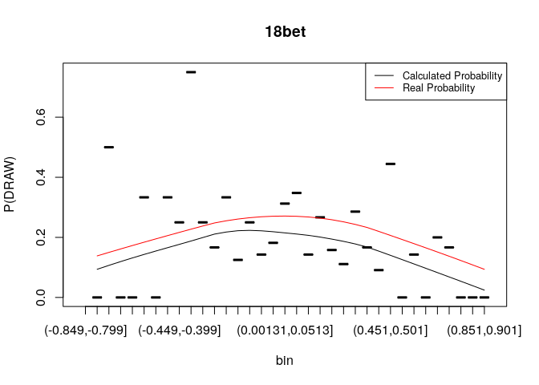<!-- -->

```r
# Proposed(real) probability is higher, 18bet is also a good bookmaker. 
```
### Task 3

```r
# Read goal data
goals <- fread("/home/ceyonur/git/CMPE/fall19-ceyonur/data/homework1/goals.csv")
# Find goals scored after 90 (90 + x), 90 is not counted because 90 is considered to be in the match time.
goals <- goals[time > 90]
# Split goal data (x-x) to away and home score columns
goals <- goals[,c("home_score", "away_score") := tstrsplit(score, '-', type.convert = TRUE)]
# Find the score before the extra time score. So that we can find the score right before the extra times.
goals <- goals[, match_hometeam_endtime_score := home_score - (as.integer(home_scorer != ""))]
goals <- goals[, match_awayteam_endtime_score := away_score - (as.integer(away_scorer != ""))]
# Get rid of other extra time scores, since we aim to find the "before extra time" score.
goals <- goals[order(match_id, time)]
goals <- unique(goals, by="match_id")
goals
```

```
##      match_id time  home_scorer score away_scorer home_score away_score
##   1:    13278 90+7      Zaha W. 2 - 2                      2          2
##   2:    13284 90+3    Niasse O. 2 - 4                      2          4
##   3:    13291 90+5 Batshuayi M. 4 - 2                      4          2
##   4:    13296 90+2 Cleverley T. 2 - 1                      2          1
##   5:    13323 90+2  Martial A.  4 - 0                      4          0
##  ---                                                                   
## 470:   278727 90+2    Kurtic J. 2 - 1                      2          1
## 471:   278731 90+5  Castagne T. 2 - 2                      2          2
## 472:   278732 90+4              1 - 2    Dzeko E.          1          2
## 473:   278746 90+5  Bourabia M. 1 - 0                      1          0
## 474:   281114 90+1              2 - 1                      2          1
##      match_hometeam_endtime_score match_awayteam_endtime_score
##   1:                            1                            2
##   2:                            1                            4
##   3:                            3                            2
##   4:                            1                            1
##   5:                            3                            0
##  ---                                                          
## 470:                            1                            1
## 471:                            1                            2
## 472:                            1                            1
## 473:                            0                            0
## 474:                            2                            1
```

```r
# merge these data with english premier league data (left join).
merged <- merge(epl_matches, goals[, c("match_id", "match_hometeam_endtime_score", "match_awayteam_endtime_score")], all.x= TRUE)
# there could be some "NA" matches since there are some matches without any extra time needed. So we assume their "endtime" score as their final score.
merged <- merged[, match_hometeam_endtime_score := ifelse(is.na(match_hometeam_endtime_score),match_hometeam_score, match_hometeam_endtime_score)]
merged <- merged[, match_awayteam_endtime_score := ifelse(is.na(match_awayteam_endtime_score),match_awayteam_score, match_awayteam_endtime_score)]
# Calculate the final match result (home win = 1, away win = -1, draw = 0)
merged <- merged[, match_score_status := match_hometeam_score - match_awayteam_score]
merged <- merged[, match_score_status := ifelse(match_score_status == 0, 0, ifelse(match_score_status > 0, 1, -1))]
# Calculate also the "before extra time" match result.
merged <- merged[, match_endtime_score_status := match_hometeam_endtime_score - match_awayteam_endtime_score]
merged <- merged[, match_endtime_score_status := ifelse(match_endtime_score_status == 0, 0, ifelse(match_endtime_score_status > 0, 1, -1))]
# Find matches which has changed result after the extra times(endtime).
excluded_endtime_matches <- merged[match_endtime_score_status != match_score_status]
# count of excluded matches due to extra time score change.
nrow(excluded_endtime_matches)
```

```
## [1] 23
```


```r
# read booking data
bookings <- fread("/home/ceyonur/git/CMPE/fall19-ceyonur/data/homework1/booking.csv")
# find matches with red card before 15 mins. 
excluded_bookings <- bookings[card == "red card" & time <= 15]
# count of excluded matches due to red card.
nrow(excluded_bookings)
```

```
## [1] 17
```


```r
excluded_match_ids <- unique(c(excluded_endtime_matches$match_id, excluded_bookings$match_id))
'%!in%' <- function(x,y)!('%in%'(x,y))
excluded_merged_data = merged_data[match_id %!in% excluded_match_ids]
# removed match count
nrow(merged_data) - nrow(excluded_merged_data)
```

```
## [1] 2262
```
### Task 2 (after removing noise data)
### First bookmaker

```r
# 1st
first_excluded_bookmaker_name <- bookmaker_names[1]
# Task 2.1-2
first_excluded_bets <- bookmaker_draw_analysis(first_excluded_bookmaker_name, excluded_merged_data)
first_excluded_bin_table <- bookmaker_bin_table(first_excluded_bets)
# Task 2.3
plot(first_excluded_bets$p_win_imp - first_excluded_bets$p_lose_imp, first_excluded_bets$p_draw_imp,cex=0.5,col='red',xlab="P(WIN_IMP) - P(LOSE_IMP)", ylab="P(DRAW_IMP)", main = first_excluded_bookmaker_name)
```

<!-- -->

```r
# Task 2.4
plot(first_excluded_bin_table$w_l_cut, first_excluded_bin_table$emprical_over,ylab="P(DRAW)",xlab="bin", main = first_excluded_bookmaker_name)
lines(lowess(first_excluded_bin_table$w_l_cut, first_excluded_bin_table$emprical_over), col="black", lwd=1)
lines(lowess(first_excluded_bin_table$w_l_cut, first_excluded_bin_table$probabilistic_over), col="red", lwd=1)
lines(lowess(first_bin_table$w_l_cut, first_bin_table$emprical_over), col="green", lwd=1)
legend("topright", legend=c("Calculated Probability", "Real Probability", "Original Calculated Probability"), col=c("black","red", "green"), lty=1:1, cex=0.8)
```

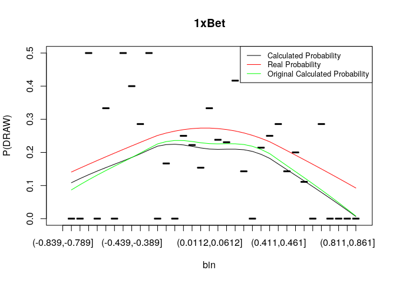<!-- -->

```r
# When we compare original (before excluding matches) with current calculated proability, there is no big differences. The current one is a little bit below than the original one.
```
### Second bookmaker

```r
# 2nd
second_excluded_bookmaker_name <- bookmaker_names[2]
# Task 2.1-2
second_excluded_bets <- bookmaker_draw_analysis(second_excluded_bookmaker_name, excluded_merged_data)
second_excluded_bin_table <- bookmaker_bin_table(second_excluded_bets)
# Task 2.3
plot(second_excluded_bets$p_win_imp - second_excluded_bets$p_lose_imp, second_excluded_bets$p_draw_imp,cex=0.5,col='red',xlab="P(WIN_IMP) - P(LOSE_IMP)", ylab="P(DRAW_IMP)", main = second_excluded_bookmaker_name)
```

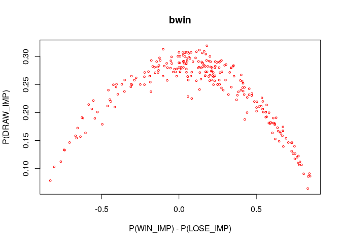<!-- -->

```r
# Task 2.4
plot(second_excluded_bin_table$w_l_cut, second_excluded_bin_table$emprical_over,ylab="P(DRAW)",xlab="bin", main = second_excluded_bookmaker_name)
lines(lowess(second_excluded_bin_table$w_l_cut, second_excluded_bin_table$emprical_over), col="black", lwd=1)
lines(lowess(second_excluded_bin_table$w_l_cut, second_excluded_bin_table$probabilistic_over), col="red", lwd=1)
lines(lowess(second_bin_table$w_l_cut, second_bin_table$emprical_over), col="green", lwd=1)
legend("topright", legend=c("Calculated Probability", "Real Probability", "Original Calculated Probability"), col=c("black","red", "green"), lty=1:1, cex=0.8)
```

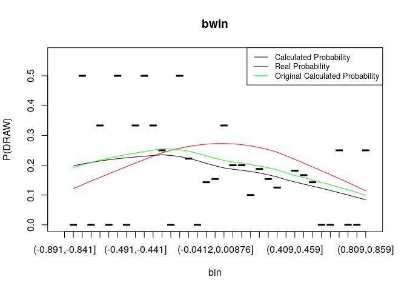<!-- -->

```r
# When we compare original (before excluding matches) with current calculated proability, there is no big differences. The current one is a little bit below than the original one.
```
### Third bookmaker

```r
# 3rd
third_excluded_bookmaker_name <- bookmaker_names[3]
# Task 2.1-2
third_excluded_bets <- bookmaker_draw_analysis(third_excluded_bookmaker_name, excluded_merged_data)
third_excluded_bin_table <- bookmaker_bin_table(third_excluded_bets)
# Task 2.3
plot(third_excluded_bets$p_win_imp - third_excluded_bets$p_lose_imp, third_excluded_bets$p_draw_imp,cex=0.5,col='red',xlab="P(WIN_IMP) - P(LOSE_IMP)", ylab="P(DRAW_IMP)", main = third_excluded_bookmaker_name)
```

<!-- -->

```r
# Task 2.4
plot(third_excluded_bin_table$w_l_cut, third_excluded_bin_table$emprical_over,ylab="P(DRAW)",xlab="bin", main = third_excluded_bookmaker_name)
lines(lowess(third_excluded_bin_table$w_l_cut, third_excluded_bin_table$emprical_over), col="black", lwd=1)
lines(lowess(third_excluded_bin_table$w_l_cut, third_excluded_bin_table$probabilistic_over), col="red", lwd=1)
lines(lowess(third_bin_table$w_l_cut, third_bin_table$emprical_over), col="green", lwd=1)
legend("topright", legend=c("Calculated Probability", "Real Probability", "Original Calculated Probability"), col=c("black","red", "green"), lty=1:1, cex=0.8)
```

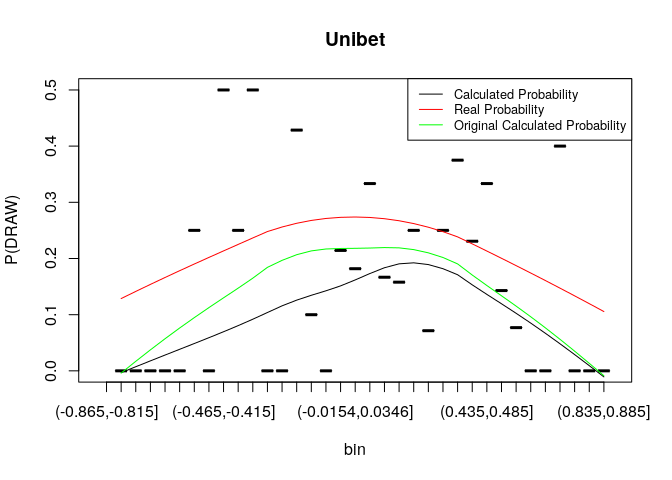<!-- -->

```r
# This one has a much bigger difference between original and current probability line. Seems like bookmaker considered the situtations more accuratly than other bookmakers. Since the calculated probability is further away from the proposed probability.
```
### Fourth bookmaker

```r
# 4th
fourth_excluded_bookmaker_name <- bookmaker_names[4]
# Task 2.1-2
fourth_excluded_bets <- bookmaker_draw_analysis(fourth_excluded_bookmaker_name, excluded_merged_data)
fourth_excluded_bin_table <- bookmaker_bin_table(fourth_excluded_bets)
# Task 2.3
plot(fourth_excluded_bets$p_win_imp - fourth_excluded_bets$p_lose_imp, fourth_excluded_bets$p_draw_imp,cex=0.5,col='red',xlab="P(WIN_IMP) - P(LOSE_IMP)", ylab="P(DRAW_IMP)", main = fourth_excluded_bookmaker_name)
```

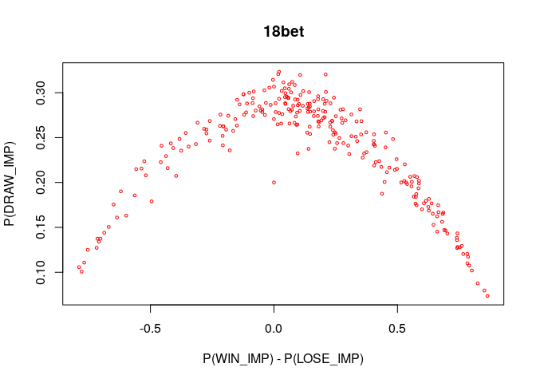<!-- -->

```r
# Task 2.4
plot(fourth_excluded_bin_table$w_l_cut, fourth_excluded_bin_table$emprical_over,ylab="P(DRAW)",xlab="bin", main = fourth_excluded_bookmaker_name)
lines(lowess(fourth_excluded_bin_table$w_l_cut, fourth_excluded_bin_table$emprical_over), col="black", lwd=1)
lines(lowess(fourth_excluded_bin_table$w_l_cut, fourth_excluded_bin_table$probabilistic_over), col="red", lwd=1)
lines(lowess(fourth_bin_table$w_l_cut, fourth_bin_table$emprical_over), col="green", lwd=1)
legend("topright", legend=c("Calculated Probability", "Real Probability", "Original Calculated Probability"), col=c("black","red", "green"), lty=1:1, cex=0.8)
```

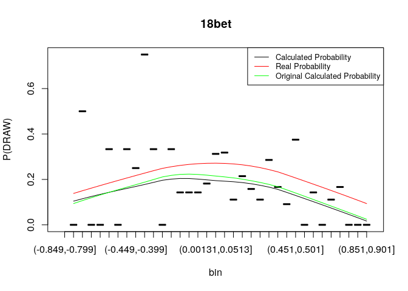<!-- -->

```r
# When we compare original (before excluding matches) with current calculated proability, there is no big differences. The current one is a little bit below than the original one.
```
